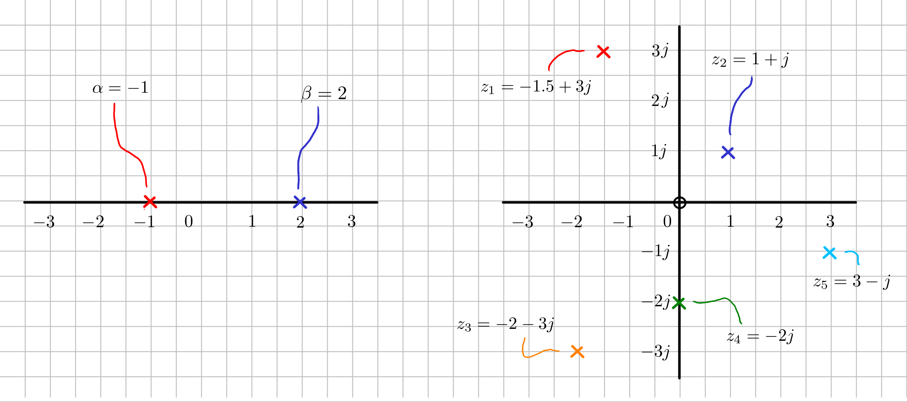

---
jupytext:
  cell_metadata_filter: -all
  formats: md:myst
  text_representation:
    extension: .md
    format_name: myst
    format_version: 0.13
    jupytext_version: 1.10.3
kernelspec:
  display_name: Python 3
  language: python
  name: python3
---

# Complexe getallen

## Home


- [Definities](#definities)
- [Tweedimensionaal](#tweedimensionaal)
	- [Modulus - Absolute waarde - Afstand](#modulus---absolute-waarde---afstand)
	- [Argument - Hoek - Fase](#argument---hoek---fase)
- [Rekenen met complexe getallen](#rekenen-met-complexe-getallen)
	- [Som - Verschil](#som---verschil)
	- [Product - Quotiënt](#product---quotiënt)

## Andere bronnen
[[Home](#home)]

- [3Blue1Brown - Complex number fundamentals | Lockdown math ep. 3](https://www.youtube.com/watch?v=5PcpBw5Hbwo&list=PLZHQObOWTQDP5CVelJJ1bNDouqrAhVPev&index=4)

In de bovenstaande video wordt een opfrisser gegeven voor wie daar behoefte aan heeft.


## Definities
[[Home](#home)]

Een complex getal bestaat uit een reëel deel en een imaginair deel. In dit vak gebruiken we $j$ om het de imaginaire eenheid $j = \sqrt{-1}$ weer te geven. We kunnen een eenvoudig complex getal $z$ dan schrijven als:

$$ z = a + bj; \quad a, b \in \mathbb{R} \rightarrow z \in \mathbb{C};$$

$$ \mathrm{Re}(z) = a, \ \mathrm{Im}(z) = b .$$

De *complex geconjugeerde* van $z$ is:

$$ \bar{z} = \mathrm{Re}(z) - j \cdot \mathrm{Im}(z) = a - bj. $$

```{code-cell}
---
render:
  image:
    <!-- width: 100% -->
    height: 450px
    alt: first-plot
    classes: shadow p-8 mb-5 bg-light rounded
  figure:
    caption: Een complex getal wordt vaak in het complexe vlak weergegeven. Daarbij is het ook vaak handig om meteen een eenheidscirkel (met als middelpunt de oorsprong, en straal 1) te tekenen.
---
import math
import plot_tools

z = 0.5 + 1.5j
z_bar = z.conjugate()

print(f"z = {z}.     Re(z) = {z.real}.     Im(z) = {z.imag}.")
print(f"z_bar = {z_bar}. Re(z_bar) = {z_bar.real}. Im(z_bar) = {z_bar.imag}.")

fig, ax = plot_tools.create_complex_plane()
plot_tools.plot_complex(z, f'z = {z}', ax=ax, plot_arc=True, xkcd=True);
plot_tools.plot_complex(z.conjugate(), f'\\bar{{z}} = {z.conjugate()}', ax=ax, plot_arc=True, xkcd=True); 
 
```


## Tweedimensionaal 
[[Home](#home)]

Net als een gewoon getal op een 1-D getallenlijn, kunnen we een complex getal op een 2-D vlak weergeven.


<!--  -->
<!--  -->

### Modulus - Absolute waarde - Afstand
[[Home](#home)]


Voor een gewoon getal gebruiken we de notatie $|a|$ om de afstand van $a$ tot de oorsprong van de getallenlijn aan te geven. Voor een complex getal is dat net zo. Nu is de afstand nu een klein beetje lastiger te bepalen, we moeten de schuine zijde van een driehoek bepalen:

$$ |z| = \sqrt{a^2 + b^2} .$$

Let op dat we een afstand aan het bepalen zijn en je hierbij dus $b$ invult voor het imaginaire deel, niet $bj$. Nog netter zou zijn om te zeggen dat we eerst de absolute waarden van $a$ en $bj$ nemen, en de uitkomst daarvan in de Pythagoras-formule invoeren. Driehoeken hebben namelijk over het algemeen geen negatieve zijden!

Soms is het handiger om de volgende formule te gebruiken, die equivalent is aan het bovenstaande:

$$ |z| = \sqrt{z \cdot \bar{z}} =  \sqrt{(a + bj)\cdot(a - bj)} = \sqrt{a^2 + b ^2}  . $$


```{code-cell}
import math
import numpy as np

z = 1 + 2j
z_abs = abs(z)
z_pyth = math.sqrt(z.real ** 2 + z.imag ** 2)

# math.sqrt werkt niet met variabelen van het type 'complex' (!), dus np.sqrt()
z_z_conj = np.sqrt(z * z.conjugate())

print(f"Twee manieren om modulus te bepalen:\n")
print(f"o Absolute waarde: \n{z_abs}\n")
print(f"o Pythagoras:\n {z_pyth}\n")
print(f"o Wortel van binnenproduct met geconjugeerde:\n{z_z_conj}")

```


<!--  -->


### Argument - Hoek - Fase
[[Home](#home)]


Voor veel toepassingen is het  van belang dat we de hoek die het complexe getal maakt ten opzichte van de positief reële as kunnen uitrekenen. Dit is gelukkig ook nog goed te doen omdat we een driehoek herkennen,

$$ \angle z =^? \tan^{-1} \left(  \frac{b}{a}  \right).$$


Het wordt iets lastiger als het complexe getal zich niet in het kwadrant rechtsboven bevindt: we krijgen dan een negatieve waarde voor $a$ en/of $b$. Als $a<0$ en $b < 0$ en je blind bovenstaande formule in je rekenmachine invoert, vallen de minnen tegen elkaar weg, en zou je zomaar kunnen denken dat het complexe getal zich rechtsboven de oorsprong bevindt. Het is vaak een goed idee om een (mentale) schets te maken van de situatie om te voorkomen dat je hier iets fout doet.

Geavanceerde rekenmachines (of sotftware zoals Matlab / Numpy) hebben soms een speciale functie `atan2(teller, noemer)` geïmplementeerd om dit automatisch voor je op te lossen. Je moet dan de teller en de noemer als losse argumenten invoeren om te zorgen dat de functie weet welk deel er positief en welk negatief is.

Zie bijvoorbeeld:

- Matlab Help Center - [`atan2`](https://www.mathworks.com/help/matlab/ref/atan2.html) *Four-quadrant inverse tangent;*
- Numpy Manual - [`numpy.arctan2`](https://numpy.org/doc/stable/reference/generated/numpy.arctan2.html) *Element-wise arc tangent of x1/x2 choosing the quadrant correctly.*


<!--  -->

<!-- <video width="750" height="350" controls>
  <source src="img/complex_arg.webm" type="video/mp4">
</video>
 -->
<!--  -->

```{code-cell}
import math
import numpy as np

def hoek_van_complex(x, in_graden=False):
    """ Bereken de hoek / het argument van complex getal x.
    
    input x           : het complexe getal
    input in_graden   : (bool) converteer de hoek naar graden (optioneel)
    output            : de hoek die het complexe getal met de positief reeele as maakt.
    
    """

    if x.real == 0:
        atan_o_a = (math.pi if x.imag > 0 else -math.pi) / 2
    else:
        atan_o_a = math.atan(x.imag / x.real)

    ans = atan_o_a if x.real >= 0 else math.pi + atan_o_a

    return math.degrees(ans) if in_graden else ans


z_list = [
  -1.5 + 3j,
  1 + 1j,
  -2 -3j,
  0 -2j, 
  3 - 1j,
]

for iz, z in enumerate(z_list):
    hoek_z = hoek_van_complex(z, in_graden=True)

    print(f"o z_{iz}       = {z}")
    print(f"  hoek(z_{iz}) = {hoek_z}")
    print(f"  arctan2   : {math.degrees(np.arctan2(z.imag, z.real))}\n")


```


## Rekenen met complexe getallen
[[Home](#home)]

Ondanks dat een complex getal op zich al fascinerend kan zijn, zijn we vaak geïnteresseerd in het uitvoeren van operaties op meerdere complexe getallen tegelijk. Daarom is het belangrijk dat je de basisregels hiervoor kent.

### Som - Verschil
[[Home](#home)]

Twee complexe getallen bij elkaar optellen is niets meer dan het los optellen van de reële delen en de imaginaire delen. We kunnen dat visualiseren door de vectoren kop-staart aan elkaar vast te knopen.

$$ 
z_1 = a + bj, \quad z_2 = c + dj;$$
$$\text{Som}\quad z_1 + z_2 = (a + c) + (b + d) j ,
\qquad \text{Verschil} \quad z_1 - z_2 = (a - c) + (b - d) j .$$


Een complex getal van het andere aftrekken gaat op dezelfde manier, alleen nu keren we eerst de tweede vector om voordat we deze kop-staart aan de eerste leggen.


### Product - Quotiënt
[[Home](#home)]

Twee complexe getallen vermenigvuldigen is een klein stukje lastiger, maar veel scheelt het niet. Werk de haakjes uit en kom tot het volgende:

$$ 
z_1 = a + bj, \quad z_2 = c + dj;$$

$$
\text{Product} \quad z_1 \cdot z_2 = (ac - bd) + (bc + ad) j, \qquad
\text{Quotiënt} \quad \frac{z_1}{z_2} = \frac{z_1 }{z_2} \cdot \frac{\bar{z_2}}{\bar{z_2}} = \frac{(ac + bd ) + (bc - ad ) j}{c^2 + d^2} 
.$$

Hier is iets speciaals aan de hand dat niet direct zichtbaar is:

$$ |z_1 \cdot z_2|^2 = { (ac-bd)^2 + (bc + ad)^2 } = 
{ a^2c^2 -2abcd + b^2 d^2 + b^2 c^2 + 2abcd + a^2 d^2 }= 
\qquad \qquad \qquad  \qquad
$$
$$ 
\qquad \qquad \qquad \qquad
{a^2c^2 + b^2 d^2 + b^2 c^2 +  a^2 d^2 } = 
({a^2 + b^2}) \cdot ({c^2 + d^2}) 
= 
|z_1|^2 \cdot |z_2|^2 
.$$

Omdat alle termen die niet wegvallen positief zijn, kunnen we aan beide kanten de wortel nemen en concluderen we: 

$$|z_1 \cdot z_2| = |z_1| \cdot |z_2|.$$

We zullen het hier niet verder afleiden, maar voor de fasehoek van het product geldt (je kunt dit het beste doen door de getallen in de exponentiele vorm te schrijven, waarover in een eigen document meer informatie):

$$ \angle \left[ z_1 \cdot z_2 \right] = \angle(z_1) + \angle(z_2). $$

Een gevolg van deze twee opmerkelijke zaken is dat het vermenigvuldigen van een complex getal met $j$ het originele getal qua magnitude niet verandert, maar de hoek die het getal maakt met +90 graden verschuift (merk op: $|j| = 1, \angle(j) = 90^\circ$).

Een zelfde truc kunnen we toepassen op het quotiënt, waaruit zal blijken dat:

$$ \left| \frac{z_1}{z_2} \right| = \frac{|z_1|}{|z_2|} \quad 
\text{en} \quad
 \angle \left[ \frac{z_1}{z_2} \right] = \angle(z_1) - \angle(z_2). $$

Een complex getal delen door $j$ laat dus ook de magnitude met rust, maar draait het getal met een negatieve hoek van 90 graden.


