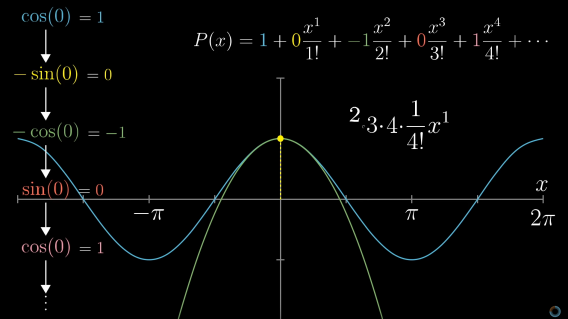
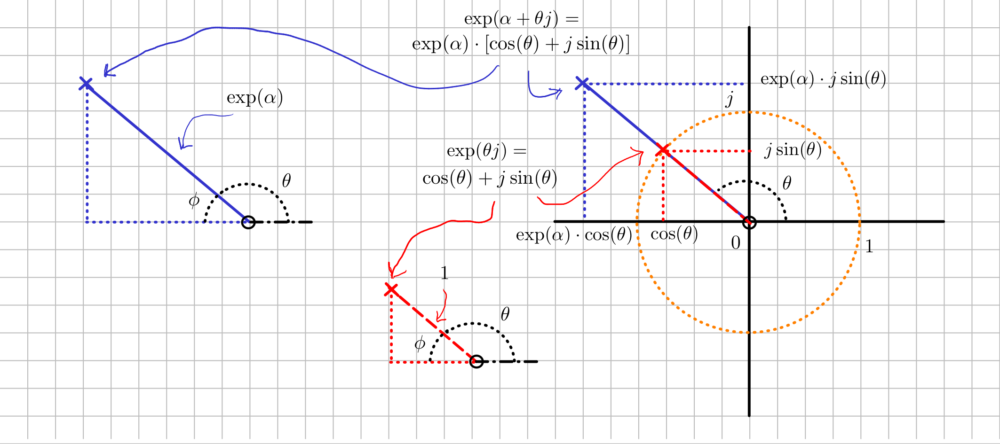

---
jupytext:
  cell_metadata_filter: -all
  formats: md:myst
  text_representation:
    extension: .md
    format_name: myst
    format_version: 0.13
    jupytext_version: 1.10.3
kernelspec:
  display_name: Python 3
  language: python
  name: python3
---

# De functies exp, sin, cos

## Home
- [Andere bronnen](#andere-bronnen)
- [Definities](#definities)
- [Differentiëren](#differentiëren)
- [Imaginaire waarden in exp](#imaginaire-waarden-in-exp)
- [Complexe waarden in exp](#complexe-waarden-in-exp)
- [Diffferentiaalvergelijkingen](#differentiaalvergelijkingen)
	- [Eerste orde](#eerste-orde)
	- [Tweede orde](#tweede-orde)
	- [Stelsels eerste orde vergelijkingen](#stelsels-eerste-orde-vergelijkingen)


```{code-cell}
---
render:
  image:
    <!-- width: 100% -->
    height: 450px
    alt: first-plot
    classes: shadow p-8 mb-5 bg-light rounded
  figure:
    caption: Figure caption.
---


import numpy as np
import matplotlib.pyplot as plt
from matplotlib import rcParams
rcParams["axes.unicode_minus"] = False

alpha = -4
npoints = 12
x = np.cos([2 * np.pi * pt / npoints for pt in range(npoints)])
y = np.sin([2 * np.pi * pt / npoints for pt in range(npoints)])


fig, ax = plt.subplots(figsize=(9, 5), dpi=300);
with plt.xkcd():
    circle1 = plt.Circle((0, 0), 1, zorder=5, edgecolor='r', facecolor='none');
    ax.add_patch(circle1);
    ax.scatter(x,  y, marker='x', zorder=10);
    ax.grid(True, lw=1, zorder=-10);

ax.xaxis.set_major_locator(plt.MaxNLocator(3))
ax.yaxis.set_major_locator(plt.MaxNLocator(3))
ax.set_aspect('equal', adjustable='datalim');
ax.set_xlabel('Real Part');
ax.set_ylabel('Imaginary Part');

```


```{code-cell}
---
render:
  image:
    <!-- width: 100% -->
    height: 450px
    alt: second-plot
    classes: shadow p-8 mb-5 bg-light rounded
  figure:
    caption: Figure caption 2.
---

import numpy as np
import matplotlib.pyplot as plt
from matplotlib import rcParams
rcParams["axes.unicode_minus"] = False

N_periods = 2
t = np.arange(0, N_periods * 2 * np.pi, .01)
y_sin = np.sin(t)
y_cos = np.cos(t)
y_exp = np.exp(-t)


fig2, ax2 = plt.subplots(figsize=(9, 5), dpi=300);
with plt.xkcd():
    ax2.plot(t, y_sin, label="$f(t) = \sin(t)$");
    ax2.plot(t, y_cos, label="$f(t) = \cos(t)$");
    ax2.plot(t, y_exp, label="$f(t) = \exp(-t)$");
ax2.legend();
ax2.grid();
ax2.set_xlabel('Time (s)');
ax2.set_ylabel('f(t)');

```


```{code-cell}
---
render:
  image:
    <!-- width: 100% -->
    height: 450px
    alt: third-plot
    classes: shadow p-8 mb-5 bg-light rounded
  figure:
    caption: Figure caption 3.
---

import numpy as np
import matplotlib.pyplot as plt
from matplotlib import rcParams
rcParams["axes.unicode_minus"] = False

(x, y) = np.meshgrid(np.arange(-2, 2, .1), np.arange(-2, 2, .1))

z = np.sqrt(x ** 2 + y ** 2)

fig2 = plt.figure(figsize=(9, 5), dpi=300);
ax = fig2.add_subplot(projection='3d')
ax.plot_surface(x, y, z)
ax.set(xlabel='x', ylabel='y', zlabel='z', title='z = |z|')

ax.grid();


# ax2.set_xlabel('Time (s)');
# ax2.set_ylabel('f(t)');

```


## Andere bronnen
[[Home](#home)]

- [(Youtube) 3Blue1Brown - Essence of calculus (serie)](https://www.youtube.com/playlist?list=PLZHQObOWTQDMsr9K-rj53DwVRMYO3t5Yr)
- [(Youtube) 3Blue1Brown - Differential Equations (serie)](https://www.youtube.com/playlist?list=PLZHQObOWTQDNPOjrT6KVlfJuKtYTftqH6)
- [(Youtube) 3Blue1Brown - Trigonometry fundamentals | Lockdown math ep. 2](https://www.youtube.com/watch?v=yBw67Fb31Cs&list=PLZHQObOWTQDP5CVelJJ1bNDouqrAhVPev&index=3)

YouTube-kanaal waarin met behulp van animaties wiskundige concepten worden toegelicht. De series over calculus, differentiaalvergelijkingen zijn de moeite waard. Er is ook een special over de functies waar dit document over gaat.



- [(MIT) Arthur Mattuck - 18.03 Differential Equations](https://ocw.mit.edu/courses/mathematics/18-03-differential-equations-spring-2010/video-lectures/)

Collegereeks over differentiaalvergelijkingen. De kwaliteit van de video's is niet erg goed, maar de colleges zijn nog goed te volgen.


## Definities
[[Home](#home)]

We gaan niet te diep in op de achtergrond van Taylor series, maar noemen wel de drie series die de $\sin, \cos, \exp$-functies definiëren. Voor de leesbaarheid schrijven we in dit document $e^x$ liever als $\exp(x)$.


$$ \exp(x) = 
1 + 
x + 
\frac{1}{2!} x^2 + 
\frac{1}{3!} x^3 + 
\frac{1}{4!} x^4 + 
\cdots 
= 
\sum_{n=0}^\infty 
\frac{1}{n!} 
x^n 
;$$

$$ \cos(x) = 
1 -
\frac{1}{2!} x^2 +
\frac{1}{4!} x^4 -
\frac{1}{6!} x^6 +
\frac{1}{8!} x^8 -
\cdots 
= 
\sum_{n=0}^\infty 
(-1)^{n} 
\frac{1}{(2n)!} 
x^{2n} 
;$$

$$ \sin(x) =  
x - 
\frac{1}{3!} x^3 + 
\frac{1}{5!} x^5 - 
\frac{1}{7!} x^7 + 
\frac{1}{9!} x^9 - 
\cdots 
= 
\sum_{n=0}^\infty 
(-1)^{n} 
\frac{1}{(2n+1)!} 
x^{2n+1} 
.$$


## Differentiëren
[[Home](#home)]

De functies $\exp, \cos, \sin$ zijn vooral zo speciaal omdat hun afgeleiden een sterk patroon volgen:

$$ \frac{d}{dx} \exp(x) = \exp(x); $$
$$ \frac{d}{dx} \cos(x) = -\sin(x); $$
$$ \frac{d}{dx} \sin(x) = \cos(x). $$

Dit maakt ze geschikte kandidaten om als oplossingen voor *gewone* differentiaalvergelijken, waarin een de variabele gelijk moet zijn aan zijn eigen afgeleiden, mogelijk geschaald met een constante. We laten het verifiëren van de bovenstaande afgeleiden even zitten, maar als je de Taylor-series hierboven gebruikt is dat eenvoudig.


## Imaginaire waarden in exp
[[Home](#home)]

Je hebt de onderstaande formule *Euler's formula* vast wel eens gezien:
$$ \exp(j\theta) = \cos(\theta) + j \sin(\theta).$$

Met behulp van de Taylor series hierboven kunnen we deze verifiëren:

$$\exp(j\theta) = 
1 
+ j\theta
+ \frac{1}{2!} (j\theta)^2 
+ \frac{1}{3!} (j\theta)^3 
+ \frac{1}{4!} (j\theta)^4 
+ \frac{1}{5!} (j\theta)^5 
+ \frac{1}{6!} (j\theta)^6
+ \cdots .
$$

Merk op dat $j^2 = -1$, $j^3 = -j$, etc.

$$\exp(j\theta) = 
1 
+ j\theta
- \frac{1}{2!} \theta^2 
- j\frac{1}{3!} \theta^3 
+ \frac{1}{4!} \theta^4 
+ j\frac{1}{5!} \theta^5 
- \frac{1}{6!} \theta^6
+ \cdots
$$

We kunnen nu de elementen met $j$ en zonder $j$ scheiden:

$$ \exp(j\theta) = 
\left[1 
- \frac{1}{2!} \theta^2 
+ \frac{1}{4!} \theta^4 
- \frac{1}{6!} \theta^6
+ \cdots
\right]
+
j\cdot \left[
 \theta
- \frac{1}{3!} \theta^3 
+ \frac{1}{5!} \theta^5 
- \cdots
\right]
.
 $$


Op een zelfde manier kunnen we de twee formules gebruiken om de éne functie in de andere om te schrijven. Merk op dat:

$$\cos(\theta) = \mathrm{Re}(\exp(j\theta)), \qquad \sin(\theta) = \mathrm{Im}(\exp(j\theta));$$


$$ \cos(\theta) = \frac{1}{2} (\exp(j\theta) + \exp(-j\theta)), $$
$$ \sin(\theta) = \frac{1}{2j} (\exp(j\theta) - \exp(-j\theta)). $$

Uit *Euler's formula* kunnen we afleiden dat een zuiver imaginaire input $\theta j$ in $\exp$ altijd tot een output met magnitude 1 leidt, onafhankelijk van de grootte van $\theta$:

$$ |\exp(j\theta)| = |\cos(\theta) + j \sin(\theta)| = \sqrt{\cos^2(\theta) + \sin^2(\theta)} =1. $$

Voor de fase van $\exp(j\theta)$ geldt het volgende:

$$ 
\angle \exp(\theta j) = 
\angle 
\left[ \cos(\theta) + j \sin(\theta) \right] = 
\tan^{-1}\left(
\frac{\cos(\theta)}{\sin(\theta)}
\right)
=
\tan^{-1} [\tan (\theta)]
=
\theta.
 $$


## Complexe waarden in exp
[[Home](#home)]

Eerder, bij *Euler's formula*, hebben we al gezien wat er gebeurt als we een puur imaginair getal aan de exponentiele functie geven. Wanneer we een complex getal met reëel deel als input gebruiken, kunnen we de bijdrage van het reële deel en die van het imaginaire deel scheiden.

$$
\exp(\alpha + \theta j) =
e^{\alpha + \theta j} = 
e^{\alpha} \cdot e^{\theta j} =
\exp(\alpha) 
\cdot
\left[  \cos(\theta) + j \sin(\theta) \right]
.$$

Dit leidt ertoe dat $\alpha$ alleen invloed heeft op $|\exp(\alpha + \theta j)|$:


$$ 
|\exp(\alpha + \theta j)| = 
|\exp(\alpha)|
\cdot 
| \cos(\theta) + j \sin(\theta) |  = 
\exp(\alpha)
.$$

Voor de fase geldt dat $\angle \exp(\alpha) = 0$, en dat dus de fase van $\exp(\alpha + \theta j)$ alleen maar beïnvloed wordt door $\theta$ :

$$ 
\angle \exp(\alpha + \theta j) = 
\angle\left[ \exp(\alpha)\right] + 
\angle 
\left[ \cos(\theta) + j \sin(\theta) \right] = 
\angle 
\left[ \cos(\theta) + j \sin(\theta) \right] = 
\theta
.$$

De figuur hieronder geeft deze resultaten grafisch weer.




Als we functie $\exp$ willen gebruiken in toepassingen zoals differentiaalvergelijkingen die de beweging van een dynamisch systeem beschrijven hebben we een probleem wanneer de functie vaak complexe waarden aanneemt. In toepassingen komen we de exponentiele functie, met daarin complexe inputs, vaak voor in een paar met zijn complex geconjugeerde:

$$ 
\exp(\alpha + \theta j) + \exp (\alpha - \theta j) =
$$
$$
\exp(\alpha) \exp(\theta j) 
+ 
\exp(\alpha) \exp(-\theta j) = 
$$
$$
= \exp(\alpha)\cdot 
\left[ \exp(\theta j) + \exp(-\theta j) \right] =
$$
$$
\exp(\alpha) \left[ 
\cos(\theta) + j\sin(\theta)
+
\cos(-\theta) + j\sin(-\theta)
\right] =
$$
$$
\exp(\alpha) \left[ 
\cos(\theta) + j\sin(\theta)
+
\cos(\theta) - j\sin(\theta)
\right] = 2\cdot \exp(\alpha) \cdot \cos(\theta).
$$

Voor het verschil tussen de twee geconjugeerde functies kunnen we een zelfde afleiding doen, met als resultaat:

$$\exp(\alpha + \theta j) - \exp (\alpha - \theta j) =
 2  j\cdot \exp(\alpha) \cdot \cos(\theta).$$

(Je kunt in de figuur checken wat er gebeurt als we eenzelfde getal optellen met dezelfde amplitude, maar negatieve hoek.)


## Differentiaalvergelijkingen
[[Home](#home)]

De functies $\exp, \cos, \sin$ komen zoals eerder opgemerkt veel voor als we oplossingen zoeken voor differentiaalvergelijkingen. We behandelen de basis voor het oplossen van beginwaardeproblemen met *gewone* differentiaalvergelijkingen.


### Eerste orde
[[Home](#home)]

Een eenvoudig voorbeeld is een beginwaardeprobleem als volgt (waarbij we de notatie $\frac{dy(t)}{dt} = \dot{y}(t)$ gebruiken):

$$ \dot{y}(t) + k_1 y(t) = 0, \ y(0) = y_0, \quad k_1, y_0 \in \mathbb{R}. $$

Omdat we dit probleem (en de oplossing) eerder gezien hebben, stellen we de volgende oplossing voor:

$$ y(t) = c \cdot \exp(-k_1t) .$$

We verifieren:

$$ 
\frac{d}{dt} \left[c \cdot \exp(-k_1 t) \right] + 
 k_1 \left[c \cdot \exp(-k_1 t) \right] = 
\qquad\qquad\qquad \qquad
$$
$$
\qquad \qquad\qquad\qquad
-k_1 c \cdot \exp(-k_1 t) +
 k_1 c \cdot \exp(-k_1 t) = 0. 
 $$

En vinden $c$:
$$y(0) = c \cdot \exp(-k_1 \cdot 0) = c = y_0.$$


### Tweede orde
[[Home](#home)]

Een tweede voorbeeld is het volgende beginwaardeprobleem:


$$ \ddot{y}(t) + \omega_0^2 y(t) = 0, \ y(0) = y_0, \dot{y}(0) = v_0, \quad \omega_0, y_0, v_0 \in \mathbb{R}. $$

We lossen het probleem op twee manieren op (die natuurlijk achter de schermen identiek zijn):

$$ 
y_1(t) = c_1\cdot \cos(\omega_0 t) + c_2 \cdot \sin(\omega_0t), 
$$
$$ 
y_2(t) = r_1 \exp(j\omega_0 t) +  r_2 \exp(-j\omega_0 t)
$$

Eerst verifiëren we weer of onze oplossingen voldoen aan de differentiaalvergelijking:

$$ 
\frac{d^2}{dt^2} 
\left[c_1 \cdot \cos(\omega_0 t) + c_2 \sin(\omega_0 t) \right] + 
 \omega_0^2 
 \left[c_1 \cdot \cos(\omega_0 t) + c_2 \sin(\omega_0 t) \right] = \qquad \qquad\qquad \qquad
$$
$$
\qquad \qquad\qquad\qquad
-\omega_0^2\left[c_1 \cdot \cos(\omega_0 t) + c_2 \sin(\omega_0 t) \right] + 
 \omega_0^2 
 \left[c_1 \cdot \cos(\omega_0 t) + c_2 \sin(\omega_0 t) \right]  = 0.
$$


Onthoud dat: 
$$
\frac{d}{dt} \exp(j \omega_0 t) = j \omega_0  \exp(j \omega_0 t), \qquad 
\frac{d^2}{dt^2} \exp( j \omega_0 t) = - \omega_0^2 \exp(j \omega_0 t) .$$

Dit gebruiken we in het volgende:

$$ 
\frac{d^2}{dt^2} 
\left[r_1 \cdot \exp(j\omega_0 t) + r_2 \exp(-j\omega_0 t) \right] + 
 \omega_0^2 
 \left[r_1 \cdot \exp(j\omega_0 t) + r_2 \exp(-j\omega_0 t) \right] = \qquad \qquad\qquad \qquad
$$
$$
\qquad \qquad\qquad\qquad
-\omega_0^2\left[r_1 \cdot \exp(j\omega_0 t) + r_2 \exp(-j\omega_0 t) \right] + 
 \omega_0^2 
 \left[r_1 \cdot \exp(j\omega_0 t) + r_2 \exp(-j\omega_0 t) \right]  = 0.
$$

Voor de constanten $c_1, c_2$ vinden we:

$$ y_1(0) = 
c_1 \cdot \cos(\omega_0 \cdot 0) +
c_2 \cdot \sin(\omega_0 \cdot 0) 
= c_1 = y_0, $$


$$ \dot{y_1}(0) =
-\omega c_1 \cdot \sin(\omega_0 \cdot 0) +
\omega c_2 \cdot \cos(\omega_0 \cdot 0) = 
c_2 \omega_0 = v_0 \ \rightarrow \ c_2 = \frac{v_0}{\omega_0}. $$

Voor $r_1, r_2$:

$$ y_2(0) =
r_1 \cdot \exp(j\omega_0 \cdot 0) +
r_2 \cdot \exp(-j\omega_0 \cdot 0) = 
r_1 + r_2 = y_0, $$


$$ \dot{y_2}(0) = 
r_1 j\omega_0 \cdot \exp(j\omega_0 \cdot 0) -
r_2 j\omega_0 \cdot \exp(-j\omega_0 \cdot 0) = 
r_1 j\omega_0 - r_2 j\omega_0 = v_0. $$

Het laatste ziet er vervelend uit, maar is redelijk vlot op te lossen door bijvoorbeeld het stelsel vergelijkingen in matrixnotatie uit te drukken en op te lossen. We krijgen dan:

$$ r_1 =\frac{1}{2} \left(y_0- j\frac{v_0}{\omega_0} \right),\ 
r_2 = \frac{1}{2} \left( y_0 + j \frac{ v_0}{\omega_0} \right) \rightarrow \qquad\qquad$$

$$
\qquad \qquad \rightarrow  \ r_1 + r_2 = y_0, \quad r_1j - r_2j = \frac{v_0}{\omega_0} . 
$$

Het zal je waarschijnlijk niet verbazen dat $r_1 = \bar{r_2}$, en met behulp van formules die eerder langsgekomen zijn kun je nagaan dat de twee oplossingen $y_1(t)$ en $y_2(t)$ identiek zijn.


### Stelsels eerste orde vergelijkingen
[[Home](#home)]

(Deze stof komt uit het vak Lineaire Algebra, bijvoorbeeld Hoofdstuk 5 van David C. Lay. We verwachten niet dat veel studenten dit nog paraat hebben. We zullen het tijdens de instructievideo's nogmaals behandelen, maar het vast doornemen kan geen kwaad).

De voorgaande problemen waren nog met niet al te veel moeite op te lossen, maar als er in de tweede vergelijking nog een term $b\dot{y}(t)$ in de differentiaalvergelijking had gestaan is het al een stuk meer werk. Als er een term met hogere-orde afgeleide $\frac{d^n }{dt^n} y(t),\ n > 2$ in had gestaan wordt de gebruikte methode praktisch onmogelijk. Ook hebben we nog niet gekeken naar wat er gebeurt als we een stelsel van differentiaalvergelijkingen, waarin de variabelen niet eenvoudig te scheiden zijn, nog niet behandeld.

Een stelsel eerste orde differentiaalvergelijkingen ziet er als volgt uit:

$$\begin{array}{cc} 
\dot{x_1}(t) &= a_{11} x_1(t) + a_{12} x_2(t) + \cdots + a_{1n} x_n(t)\\
\dot{x_2}(t) &= a_{21} x_1(t) + a_{22} x_2(t) + \cdots + a_{2n} x_n(t)\\
\vdots & \vdots\\
\dot{x_n}(t) &= a_{n1} x_1(t) + a_{n2} x_2(t) + \cdots + a_{nn} x_n(t)\\
\end{array}. $$

In veel gevallen zullen niet alle variabelen invloed hebben op de evolutie van alle variabelen ($a_{i, j} = 0$ op veel plaatsen), maar het is toch nuttig om een stelsel vergelijkingen op zo'n gestructureerde manier op te schrijven.

Als we een hogere orde differentiaalvergelijking hebben kunnen we die vrij eenvoudig herschrijven als een stelsel eerste orde vergelijkingen. We nemen als voorbeeld:

$$  \frac{d^3 }{dt^3} y(t) +\ddot{y}(t) + 2 \dot{y}(t) + 3y(t) = 0, \qquad \ddot{y}(0) = p_0, \dot{y}(0) = v_0, y(0) = y_0. $$

Als eerste definiëren we de hulpvariabelen $x_1 (t), x_2 (t), x_3 (t)$:

$$\begin{array}{ccc}
x_1 = \ddot{y}(t) , &
x_2 = \dot{y}(t),  &
x_3 =  y(t). 
\end{array}
$$

Merk op dat:

$$\dot{x_1}(t) = \frac{d^3 }{dt^3} y(t) =-\ddot{y}(t) -2\dot{y}(t) -3 y(t) =-x_1(t) -2 x_2(t) -3 x_3(t), $$
$$\dot{x_2}(t) = x_1(t), \quad \dot{x_3}(t) = x_2(t).$$

Ons stelsel wordt dan:

$$ 
\begin{array}{crcr}
\dot{x_1}(t) =& -1\cdot x_1(t) &- \ 2 \cdot x_2(t) &-\ 3 \cdot x_3(t)\\
\dot{x_2}(t) =& 1\cdot x_1(t) &+ \ 0 \cdot x_2(t) &+ \ 0 \cdot x_3(t)\\
\dot{x_3}(t) =& 0\cdot x_1(t) &+ \ 1 \cdot x_2(t) &+\ 0 \cdot x_3(t)
\end{array} \ \rightarrow 
\left[ \begin{array}{c}  
\dot{x_1}(t)\\
\dot{x_2}(t)\\
\dot{x_3}(t)
\end{array} \right]
=
\left[ \begin{array}{rrr}
-1 & -2 & -3\\
1 & 0 &  0\\
0 & 1 &  0
\end{array} \right]
\cdot
\left[ \begin{array}{c}  
{x_1}(t)\\
{x_2}(t)\\
{x_3}(t)
\end{array} \right].
$$

We kunnen het laatste compact schrijven als $\dot{x}(t) = A x(t)$, en de beginvoorwaarden kunnen we omschrijven als $x(0) = x_0$. We stellen nu oplossingen voor die de volgende vorm hebben:

$$x(t) = c_i v_i \exp(\lambda_i t),$$

waarbij $\lambda_i, v_i$ een eigenwaarde met bijbehorende eigenvector van $A$ is, en $c_i$ een constante. We kunnen verifiëren dat deze $x(t)$ een oplossing is voor ons stelsel differentiaalvergelijkingen. Eerst bepalen we $\dot{x}(t)$:

$$ \dot{x}(t) = \lambda_i \cdot c_i v_i \exp(\lambda_i t). $$

Nu kunnen we $\dot{x}(t), x(t)$ invullen in de differentiaalvergelijking:

$$ \lambda_i \cdot c_i v_i \exp(\lambda_i t) = A c_i v_i \exp(\lambda_i t). $$

We nemen aan dat $c_i \neq 0$, en $\exp(\lambda_i t) \neq 0$. Wat overblijft als we deze wegdelen is:

$$\lambda_i v_i = A v_i.$$

Dit is een vergelijking waaraan een eigenwaarde en bijbehorende eigenvector per definitie voldoet, en we kunnen dus ook concluderen dat onze $x(t)$ een oplossing is voor $\dot{x} (t)= A x(t)$. Als onze matrix $3$ verschillende eigenwaarden, en bijbehorende eigenvectoren heeft (dit kun je zelf controleren), kunnen we drie oplossingen $x(t)$ genereren en bij elkaar optellen, en kunnen we $c_i$ zo bepalen dat aan $x(0) = x_0$ voldaan wordt.


