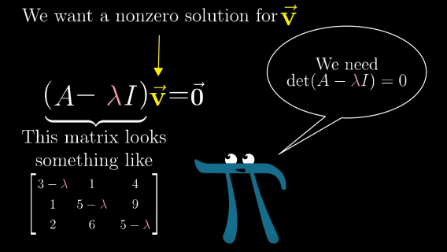
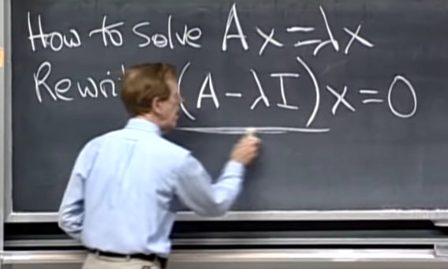
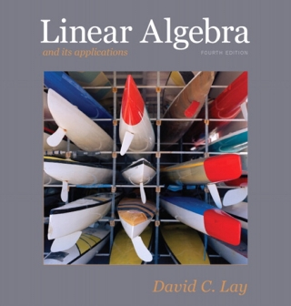

---
jupytext:
  cell_metadata_filter: -all
  formats: md:myst
  text_representation:
    extension: .md
    format_name: myst
    format_version: 0.13
    jupytext_version: 1.10.3
kernelspec:
  display_name: Python 3
  language: python
  name: python3
---


# Lineaire Algebra

## Home

We gebruiken in dit vak een aantal concepten die je eerder bij Lineaire Algebra gezien hebt. Zorg dat je bekend bent met het onderstaande en dat je comfortabel bent met het doen van de nodige berekeningen.


- [Andere bronnen](#andere-bronnen)
- [Vectoren](#vectoren)
- [Operaties met vectoren](#operaties-met-vectoren)
- [Matrices](#matrices)
- [Operaties met matrices](#operaties-met-matrices)
- [Inverse van een matrix](#inverse-van-een-matrix)
- [Eigenwaarden en eigenvectoren](#eigenwaarden-en-eigenvectoren)
- [Diagonaliseren](#diagonaliseren)
- [Machten van een matrix](#machten-van-een-matrix)
- [Referentie](#referentie)

## Andere bronnen
[[Home](#home)]

Het ophalen van je Linearie Algebra kan op veel manieren. In de tekst van dit document kun je de voor ons vak belangrijke elementen vinden. Verder kunnen we de onderstaande bronnen aanraden.


- [(Youtube) 3Blue1Brown - Eigenvectors and eigenvalues | Essence of linear algebra, chapter 14](https://www.youtube.com/watch?v=PFDu9oVAE-g&list=PLZHQObOWTQDPD3MizzM2xVFitgF8hE_ab&index=14)
YouTube-kanaal waarin met behulp van animaties wiskundige concepten worden toegelicht. De hele serie is de moeite waard, maar vooral Chapter 14: Eigenvectors and eigenvalues is voor ons belangrijk.




- [(MIT) Gilbert Strang - 18.06 Linear Algebra](https://ocw.mit.edu/courses/mathematics/18-06-linear-algebra-spring-2010/video-lectures/)
Introductievak met colleges waar de professor (Giblert Strang, auteur van diverse boeken over dit onderwerp) ouderwets op een schoolbord college geeft. De volgende colleges zijn voor ons belangrijk.

	- [Lecture 21: Eigenvalues and eigenvectors](https://ocw.mit.edu/courses/mathematics/18-06-linear-algebra-spring-2010/video-lectures/lecture-21-eigenvalues-and-eigenvectors)

	- [Lecture 22: Diagonalization and powers of A](https://ocw.mit.edu/courses/mathematics/18-06-linear-algebra-spring-2010/video-lectures/lecture-22-diagonalization-and-powers-of-a)

	- [Lecture 23: Differential equations and exp(At)](https://ocw.mit.edu/courses/mathematics/18-06-linear-algebra-spring-2010/video-lectures/lecture-23-differential-equations-and-exp-at)



- (Boek) David C. Lay - *Linear Algebra and its applications*.
Waarschijnlijk heb je dit boek gebruikt bij het eerstejaarsvak over dit onderwerp. Specifiek is het hoofdstuk over Eigenwaarden en Eigenvectoren voor dit vak van belang. Afhankelijk van welke versie van het boek je hebt, is dit Hoofdstuk 5 of 6.




## Vectoren
[[Home](#home)]

Een *vector* is een reeks getallen. In deze cursus bestaan vectoren meestal uit reële getallen, maar het kan voorkomen dat elementen complexe waarden hebben. Vectoren komen in twee smaken: *rijvectoren* en *kolomvectoren*. Standaard zullen we voor een vector *kolomvector* bedoelen, als we het over een rijvector hebben zullen we dat specifiek benoemen. We definieren de vector $x$ met $n$ elementen, met  $x_i \in \mathbb{C}$:

$$ x =  \left[ \begin{array}{c} x_1 \\ x_2 \\ \vdots \\ x_n \end{array} \right].$$

Een vector met alleen maar nullen wordt een *nulvector* genoemd, en een vector met $n$ elementen wordt ook wel een $n$-dimensionale vector genoemd. Als $x$ complexe elementen bevat, schrijven we $x \in \mathbb{C}^n$, als $x$ alleen uit reële getallen bestaat $x \in \mathbb{R}^n$.

Een rijvector krijgen we door de vector $x$ te transponeren (zie onder):

$$ x^T =  \left[ \begin{array}{cccc} x_1 & x_2 & \cdots & x_n \end{array} \right].$$

Een vector tweemaal transponeren geeft weer het origineel:

$$ (x^T)^T = x. $$


```{code-cell}
import numpy as np
x = np.array([1,2,3])
y = np.array([ [1], [2], [3] ])
z = np.array([ [1, 2, 3] ])

print(f" o Enkele haakjes: \n{x}.\n")
print(f" o Dubbele haakjes, versie 1: \n{y}.\n")
print(f" o Dubbele haakjes, versie 2: \n{z}.\n")
```

```{code-cell}
import numpy as np

# Merk op dat we voor elke 'rij' een nieuwe lijst moeten maken.
x = np.array([[2], [3], [-2]])
x_T = x.T
x_T_T = x_T.T


y = np.array([[1, 2, 3]]).T


print(f" o Vector x:\n\nx = {x}.\n")
print(f" o Getransponeerde van vector x:\n\nx_T = {x_T}.\n")
print(f" o Dubbel getransponeerde van vector x:\n\nx_T_T = {x_T_T}.\n\n")

print(f" o Vector y:\n\ny = {y}.\n")

```


## Operaties met vectoren
[[Home](#home)]

De eerste van de operaties die we vaak gebruiken zijn is het vermenigvuldigen van een vector $x$ met een scalair $\alpha \in \mathbb{C}$:

$$ \alpha x =  \left[ \begin{array}{c} \alpha x_1 \\ \alpha x_2 \\ \vdots \\ \alpha x_n \end{array} \right].$$

```{code-cell}
import numpy as np

alpha = -4
x = np.array([[1], [3], [-4]])
print(alpha * x)

```


Om de som van twee vectoren $x, y \in \mathbb{C}$ te bepalen, kunnen we de individuele elementen één voor één bij elkaar optellen:

$$ x + y = \left[ \begin{array}{c} x_1 + y_1 \\ x_2 + y_2 \\ \vdots \\ x_n + y_n \end{array} \right].$$

Het spreekt vanzelf dat we alleen vectoren die dezelfde dimensie hebben bij elkaar kunnen optellen.

```{code-cell}
import numpy as np

x = np.array([[1], [3], [-4]])
y = np.array([[3], [-3], [-2]])

print(x + y)

```


Twee vectoren met elkaar vermenigvuldigen kan op verschillende manieren. In deze cursus gebruiken we alleen het *binnenprocuct* van vectoren:

$$x \cdot y = x^T y = x_1 y_1 + x_2 y_2 + \cdots + x_n y_n.$$


```{code-cell}
import numpy as np

x = np.array([[1], [3], [-4]])
y = np.array([[3], [-3], [-2]])

print(x.T @ y)

```

## Matrices
[[Home](#home)]

Een vector is dus een reeks getallen met één rij of één kolom. Een reeks getallen met $m$ rijen en $n$ kolommen noemen we een $m$- bij $n$-dimensionale *matrix*, of afgekort een $m \times n$ *matrix*:

$$ A = \left[ \begin{array}{cccc} 
a_{11} & a_{12} & \cdots & a_{1n} \\ 
a_{21} & a_{22} & \cdots & a_{2n} \\ 
\vdots & \vdots & \ddots & \vdots \\ 
a_{m1} & a_{m2} & \cdots & a_{mn} \\ 
\end{array} \right]. $$

Een speciale matrix is de eenheidsmatrix:

$$ I = \left[ \begin{array}{cccc} 
1 & 0 & \cdots & 0 \\ 
0 & 1 & \cdots & 0 \\ 
\vdots & \vdots & \ddots & \vdots \\ 
0 & 0 & \cdots & 1 \\ 
\end{array} \right]. $$

In principe gebruiken we hoofdletters om matrices aan te geven en kleine letters voor vectoren. De notatie $A \in \mathbb{R}^{m\times n}$ gebruiken we om een $m$- bij $n$- dimensionale matrix aan te geven. Een matrix met evenveel kolommen als vectoren wordt ook wel een *vierkante matrix* genoemd. Met vierkante matrices kunnen we speciale dingen doen die we niet met niet-vierkante matrices kunnen, later meer daarover. 

We kunnen een matrix $A \in \mathbb{R}^{m\times n}$ zien als een reeks met $n$ kolomvectoren van dimensie $m$:

$$ A = \left[ \begin{array}{cccc} 
\left[ \begin{array}{c}
a_{11} \\ a_{21} \\ \vdots \\ a_{m1}
\end{array} \right] & 
\left[ \begin{array}{c}
a_{12} \\ a_{22} \\ \vdots \\ a_{m2}
\end{array} \right] &
\cdots
\left[ \begin{array}{c}
a_{1n} \\ a_{2n} \\ \vdots \\ a_{mn}
\end{array} \right]
\end{array} \right], $$

of als een reeks met $m$ rijvectoren van dimensie $n$:

$$ A = \left[ \begin{array}{c} 
\left[ \begin{array}{cccc} 
a_{11} & a_{12} & \cdots & a_{1n}
\end{array} \right] \\
 \\
\left[ \begin{array}{cccc} 
a_{21} & a_{22} & \cdots & a_{2n}
\end{array} \right] \\
\\
\vdots \\
\\
\left[ \begin{array}{cccc} 
a_{m1} & a_{m2} & \cdots & a_{mn}
\end{array} \right]
\end{array} \right]. $$

De getransponeerde van een matrix $A \in \mathbb{R}^{m\times n}$ geven we weer met $A^T \in \mathbb{R}^{n\times m}$:

$$ A^T = \left[ \begin{array}{cccc} 
a_{11} & a_{21} & \cdots & a_{m1} \\ 
a_{12} & a_{22} & \cdots & a_{m2} \\ 
\vdots & \vdots & \ddots & \vdots \\ 
a_{1n} & a_{2n} & \cdots & a_{mn} \\ 
\end{array} \right]. $$

Het spreekt vanzelf dat $(A^T)^T = A$.

[//]: # (Note that Verhaegen and Verdult incorrectly call the right-bottom element a_{nm}?)

## Operaties met matrices
[[Home](#home)]

We kunnen een matrix $A$ vermenigvuldigen met een scalair $\alpha \in \mathbb{R}$, wat er voor zorgt dat alle individuele elementen in $A$ vermenigvuldigd worden met $\alpha$:

$$ 
\alpha A = \left[ \begin{array}{cccc} 
\alpha a_{11} & \alpha a_{12} & \cdots & \alpha a_{1n} \\ 
\alpha a_{21} & \alpha a_{22} & \cdots & \alpha a_{2n} \\ 
\vdots & \vdots & \ddots & \vdots \\ 
\alpha a_{m1} & \alpha a_{m2} & \cdots & \alpha a_{mn} \\ 
\end{array} \right]
. $$

Twee matrices $A$ en $B$ bij elkaar optellen kan alleen als $A$ en $B$ dezelfde dimensie hebben. We krijgen dan:

$$
A + B = \left[ \begin{array}{cccc} 
a_{11} + b_{11} & a_{12} + b_{12} & \cdots & a_{1n} + b_{1n} \\ 
a_{21} + b_{21} & a_{22} + b_{22} & \cdots & a_{2n} + b_{2n} \\ 
\vdots & \vdots & \ddots & \vdots \\ 
a_{m1} + b_{m1} & a_{m2} + b_{m2} & \cdots & a_{mn} + b_{mn} \\ 
\end{array} \right]
. $$

Twee matrices met elkaar vermenigvuldigen is misschien wel de meest vervelende operatie die we uitvoeren, of in ieder geval als we het zonder hulp van een computer moeten doen. Het product van $A \in \mathbb{R}^{m\times n}$ met $B \in \mathbb{R}^{n\times p}$ bestaat alleen als *de dimensies kloppen* ($A$ heeft evenveel rijen als $B$ kolommen). 

De vermenigvuldiging van $C = AB$ levert ons een $[m \times n] \cdot [q \times r] \rightarrow m \times r$-dimensionale matrix op. Voor het $(i, j)$-e element van het product nemen we het binnenproduct van de $i$-e rij van $A$ met de $j$-e kolom van $B$:

$$
\left[ \begin{array}{ccc}
\ddots & \vdots & \cdot^{{\cdot}^{\cdot}}\\
\cdots & c_{ij}& \cdots\\
\cdot^{{\cdot}^{\cdot}}& \vdots & \ddots \\
\end{array} \right] 
      = 
\left[ \begin{array}{c} 
\vdots\\
\left[ \begin{array}{cccc} 
a_{i1} & a_{i2} & \cdots & a_{in}
\end{array} \right] \\
\vdots \\
\end{array} \right]
     \cdot 
\left[ \begin{array}{cccc} 
\cdots & 
\left[ \begin{array}{c}
b_{1j} \\ b_{2j} \\ \vdots \\ b_{nj}
\end{array} \right] &
\cdots
\end{array} \right]
, $$

$$ c_{ij} = a_{i1} b_{1j} + a_{i2} b_{2j} + \cdots + a_{in} b_{nj}. $$

Een matrix met de eenheidsmatrix (met de goede dimensies) vermenigvuldigen levert dezelfde matrix op:

$$D = AI = A  \ \rightarrow \ d_{ij} = a_{i1} \cdot 0 + \cdots + a_{ij} \cdot i_{jj} +\cdots + a_{in}  \cdot 0 = a_{ij}. $$

Let op dat over het algemeen $AB \neq BA$. Soms komen de dimensies niet eens uit, maar zelfs als dat wel zo is, zijn beide zijden vaak niet gelijk aan elkaar. Wat wel geldt is dat $(AB)^{T} = B^{T} A^{T}$.


## Inverse van een matrix
[[Home](#home)]

Als we twee bekende matrices $A$, $B$ hebben en een onbekende matrix $X$, en $AX = B$, hoe kunnen we dan $X$ bepalen? Het klinkt misschien als een beetje een abstracte vraag, maar in de praktijk komen we zo'n probleem vaak tegen.

Matrices op elkaar delen is iets dat niet kan, er is dus geen eenvoudige oplossing voor dit probleem: $X \neq \frac{B}{A}$. Onder bepaalde voorwaarden, waaronder dat een matrix $A$ vierkant is, kunnen we wel een inverse $A^{-1}$ bepalen waarvoor het volgende geldt:

$$ A^{-1} A = A A^{-1} = I. $$

De inverse stelt ons in staat om onze vergelijking op te lossen voor $X$:

$$ AX = B \ \rightarrow \ A^{-1}A X = A^{-1} B  \ \rightarrow \ X = A^{-1}B. $$

Hoe bepalen we zo'n inverse dan? Eén van de dingen die we nodig hebben is de *determinant* van een matrix. Voor een vierkante matrix $A \in \mathbb{R}^{n\times n}$ kunnen we die recursief bepalen met de formule:

$$\det(A) = \sum_{i=1}^n (-1)^{i + j} a_{ij} \det(A_{ij}),  $$

waarbij $A_{ij}$ een $(n-1) \times (n-1)$ matrix is waarbij we de $i$-de rij en $j$-de kolom van $A$ verwijderd hebben. Dat doen we net zo lang totdat we een $1 \times 1$-matrix over hebben. De determinant van een $1\times 1$-matrix (een scalair) is gelijk aan de matrix zelf: 
$$\alpha \in \mathbb{R} \rightarrow \det(\alpha) = \alpha.$$

In de praktijk is het bepalen van determinanten van matrices zo'n klus dat je dat eigenlijk nooit handmatig doet. Voor $2\times 2$-dimensionale matrices is dat nog goed te doen:

$$ A = \left[ \begin{array}{cc}\alpha & \beta \\ \gamma & \delta  \end{array} \right] ,$$

$$ \det(A) = (-1)^{1+1} \det(\delta) + (-1)^{2+1} \det(\alpha) = \alpha\delta - \beta\gamma.$$

Het tweede concept dat nodig is voor het bepalen van de inverse van een matrix $A$ is de *adjunctmatrix*  $\mathrm{adj}( A)$. We gaan daar niet dieper op in, maar voor ons tweedimensionale voorbeeld gaat op dat we een aantal elementen moeten verwisselen:

$$\mathrm{adj}(A) = \left[ \begin{array}{rr}\delta & -\beta \\ -\gamma & \alpha  \end{array} \right].$$ 

Met deze twee ingrediënten kunnen we de inverse bepalen:

$$ A^{-1} = \frac{1}{\det(A)} \cdot \mathrm{adj}(A). $$

Een nog niet besproken voorwaarde voor het bestaan van een inverse is dus dat de determinant van een matrix niet gelijk mag zijn aan $0$. Voor ons voorbeeld is de inverse:

$$
A^{-1} = \frac{1}{\alpha\delta - \beta\gamma}
\left[ \begin{array}{rr}
\delta & -\beta \\
-\gamma & \alpha
\end{array} \right]
 . $$

## Eigenwaarden en eigenvectoren
[[Home](#home)]

Een vaardigheid die we in dit vak veel gebruiken is het bepalen *eigenwaarden* van een matrix. Eigenwaarden kunnen we alleen van vierkante matrices bepalen. Voor een eigenwaarde $\lambda \in \mathbb{C}$ van een matrix $A \in \mathbb{R}^{n\times n}$ geldt:

$$ A x = \lambda x,$$

voor een bepaalde vector $x \in \mathbb{C}^n.$

Let op: zelfs als $A$ alleen reële elementen bevat, kunnen $\lambda$ en $x$ dus complexe waarden bevatten. Alle vectoren waarvoor het bovenstaande geldt (behalve nulvectoren) worden *eigenvectoren* van $A$ genoemd. Een eigenvector hoort bij een bepaalde eigenwaarde, maar is niet uniek: een eigenvector $x$ kunnen we met elk scalair getal $\alpha$ vermenigvuldigen, en het resultaat $(\alpha x)$ is nog steeds een eigenvector van $A$ bij de eigenwaarde $\lambda$:

$$A x = \lambda x \ \rightarrow \ \alpha A x = \alpha \lambda x = A (\alpha x) = \lambda (\alpha x). $$

Eigenwaarden kunnen we bepalen door wat manipulatie los te laten op de definitie:

$$ A x = \lambda x \ \rightarrow \ (A - \lambda I) x = 0. $$

We hadden aangenomen dat $x$ geen nulvector mag zijn, en de enige mogelijkheid waarvoor de bovenstaande vergelijking een oplossing heeft is als $\det(A - \lambda I) = 0$ (waarom dat zo is behandelen we hier niet). De eigenwaarden $\lambda_i$ van een matrix zijn de waarden voor $\lambda$ waarvoor de bovenstaande vergelijking kloppend is. $\det(A - \lambda I)$ is een $n$-de orde polynoom in $\lambda$, en we kunnen dus ook $n$ eigenwaarden vinden voor een $n\times n$-matrix.

Een eigenvector die bij de eigenwaarde $\lambda_i$ hoort kunnen we bepalen door een vector $x_i$ te bepalen waarvoor geldt dat:

$$(A - \lambda_i I) x_i = 0.$$

Iets dat handig is als we met de hand dit soort berekeningen moeten uitvoeren is dat als we een complexe eigenwaarde $\lambda_i$ vinden, de geconjugeerde $\bar{\lambda_{i}}$ ook een eigenwaarde is. Als we bij $\lambda_i$ de eigenvector $x_i$ vinden, is $\bar{x_i}$ een eigenvector bij $\bar{\lambda_i}$.


## Diagonaliseren
[[Home](#home)]

Een *diagonale matrix* is een matrix met alleen maar nullen, uitgezonderd voor de elementen die zich op de diagonaal bevinden: de matrix $D$ is een diagonale matrix als $d_{ij} = 0$ voor $i \neq j$.

Om een matrix $A \in \mathbb{R}^{n\times n}$ in een diagonale matrix $D \in \mathbb{R}^{n\times n}$ om te toveren kunnen we een trucje toepassen. We zetten eerst de $n$ eigenvectoren (als we er $n$ kunnen vinden, dat is niet altijd het geval!) in een matrix $V$:

$$ V =
\left[ \begin{array}{cccc}
x_1 & x_2 & \cdots & x_n
\end{array} \right]
. $$

Vervolgens bekijken we de matrix $AV$ van dichterbij:

$$AV = 
\left[ \begin{array}{cccc}
Ax_1 &
Ax_2 &
\cdots &
Ax_n
\end{array} \right] 
= 
\left[ \begin{array}{cccc}
\lambda_1 x_1 &
\lambda_2 x_2 &
\cdots &
\lambda_n x_n
\end{array} \right]
. $$

Het rechterdeel kunnen we verder splitsen:

$$ \left[ \begin{array}{cccc} 
\lambda_1 x_1 &
\lambda_2 x_2 &
\cdots & 
\lambda_n x_n
\end{array} \right] 
= 
\left[ \begin{array}{cccc} 
\lambda_1  & 0 & \cdots & 0\\
0  & \lambda_2 & \cdots & 0 \\
\vdots & \vdots & \ddots & \vdots \\
0 & 0 & \ldots & \lambda_n  \end{array} \right]
\cdot
\left[ \begin{array}{cccc}
 x_1 &
x_2 &
\cdots &
x_n
\end{array} \right]
. $$

De matrix met $\lambda_i$ op de diagonaal noemen we $\Lambda$. Het begin met het einde van dit verhaal samenknopen geeft dan:

$$ AV = \Lambda V \ \rightarrow V^{-1} A V = \Lambda,$$

Dit laatste resultaat, dat het vinden van de eigenvectoren ons in staat stelt om een matrix te diagonaliseren, zetten we in onze cursus in om ingewikkelde problemen te versimpelen.

## Machten van een matrix
[[Home](#home)]

Machten van matrices komen veel voor als we berekeningen doen voor dynamische systemen. Niet veel mensen vinden het fijn om een matrix veelvuldig met zichzelf te vermenigvuldigen. Over het algemeen geldt dat:


$$ A^k \neq \left[ \begin{array}{cccc} 
a_{11}^k & a_{12}^k & \cdots & a_{1n}^k \\ 
a_{21}^k & a_{22}^k & \cdots & a_{2n}^k \\ 
\vdots & \vdots & \ddots & \vdots \\ 
a_{m1}^k & a_{m2}^k & \cdots & a_{mn}^k \\ 
\end{array} \right]. $$


Door een matrix te diagonaliseren wordt dat wel een stuk makkelijker. Als we het laatste resultaat uit het vorige deel nog eens links met $V$ en rechts met $V^{-1}$ vermenigvuldigen:

$$ V V^{-1} A V V^{-1} = V \Lambda V^{-1} = IAI = A.$$

Dit stelt ons in staat om een matrix tot een macht te verheffen:

$$ A^3 = AAA =  V \Lambda V^{-1} V \Lambda V^{-1} V \Lambda V^{-1} = V \Lambda  \Lambda  \Lambda V^{-1} =  V \Lambda^3 V^{-1}. $$

Dit generaliseren leidt tot: 

$$A^k = V \Lambda^k V^{-1},$$ 

iets dat gemakkelijker te bepalen is:

$$\Lambda^k =
\left[ \begin{array}{cccc} 
\lambda_1^k  & 0 & \cdots & 0\\
0  & \lambda_2^k & \cdots & 0 \\
\vdots & \vdots & \ddots & \vdots \\
0 & 0 & \ldots & \lambda_n^k  \end{array} \right].
$$

Later zullen we dit resultaat gebruiken om een matrix-exponentieel te bepalen. Weer, in het algemeen:

$$ e^{A} \neq \left[ \begin{array}{cccc} 
e^{a_{11}} & e^{a_{12}} & \cdots & e^{a_{1n}} \\ 
e^{a_{21}} & e^{a_{22}} & \cdots & e^{a_{2n}} \\ 
\vdots & \vdots & \ddots & \vdots \\ 
e^{a_{m1}} & e^{a_{m2}} & \cdots & e^{a_{mn}} \\ 
\end{array} \right]. $$

Wat wel geldt, is:

$$ e^A = V e^{\Lambda} V^{-1} = V \left[ \begin{array}{cccc} 
e^{\lambda_1}  & 0 & \cdots & 0\\
0  & e^{\lambda_2} & \cdots & 0 \\
\vdots & \vdots & \ddots & \vdots \\
0 & 0 & \ldots & e^{\lambda_n}  \end{array} \right] V^{-1}. $$

## Referentie
[[Home](#home)]

Dit document is gebaseerd op de tekst in Hoofdstuk 2 van het boek *Filtering and System Identification: A Least Squares Approach* door Michel Verhaegen, Vincent Verdult.

